## Before optimization

### Sorting

### Sort by name

- Commit duration: 8 s
- Render duration: 432.1 ms
- Observation: The majority of rendering time is spent in CountryList, which re-renders after sorting the list of countries.

### Screenshot:

**Flame Graph:**  
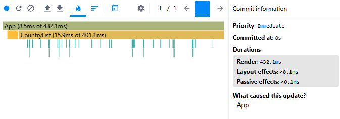  
**Ranked Chart:**  
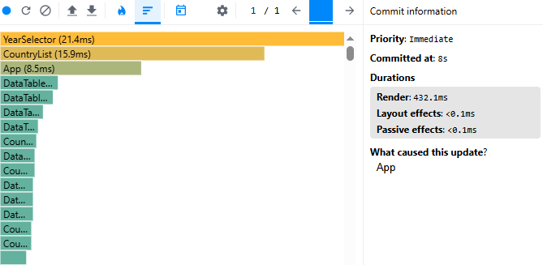

### Sort by population

- Commit duration: 4.4 s
- Render duration: 506.5 ms
- Observation: Sorting by population causes a significant re-render of the CountryList component. The majority of rendering time is spent rendering the list of countries, which indicates that the entire list is being recalculated and re-rendered on each sort.

### Screenshot:

**Flame Graph:**  
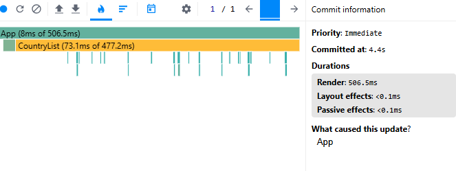  
**Ranked Chart:**  
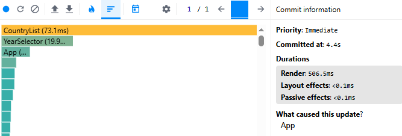

### Search country

- Commit duration: 22 s
- Render duration: 40.5 ms
- Observation: Searching does not significantly affect CountryList rendering. However, YearSelector takes most of the rendering time during the interaction, which indicates unnecessary re-rendering of this component on search input changes.

### Screenshot:

**Flame Graph:**  
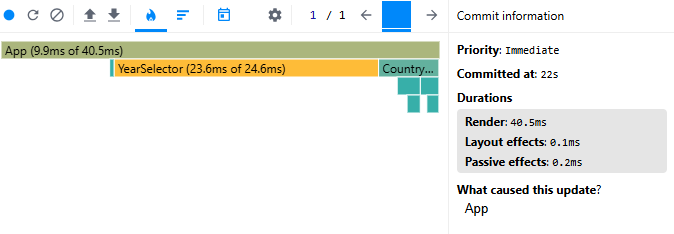  
**Ranked Chart:**  
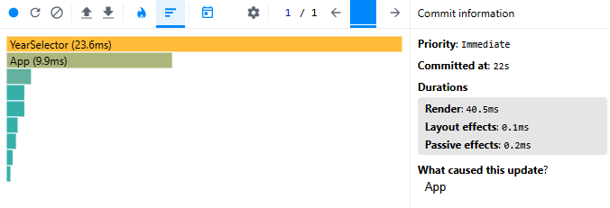

### Change year

- Commit duration: 4 s
- Render duration: 34.9 ms
- Observation: Changing the year causes a full re-render of YearSelector, which is the main performance bottleneck in this interaction. Other components like CountryList are not significantly affected.

### Screenshot:

**Flame Graph:**  
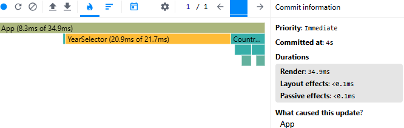  
**Ranked Chart:**  
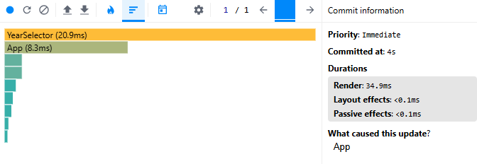

### Toggle columns

- Commit duration: 1.8 s
- Render duration: 51.1 ms
- Observation: Toggling columns causes an unnecessary re-render of YearSelector, which remains the main performance bottleneck across multiple interactions. CountryList is not significantly affected.

### Screenshot:

**Flame Graph:**  
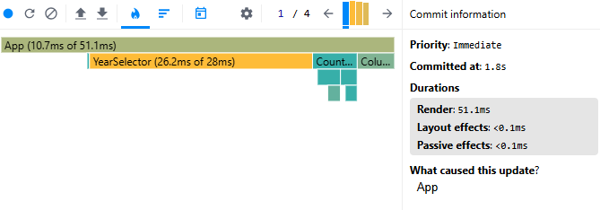  
**Ranked Chart:**  
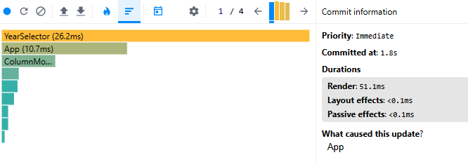

## After optimization

### Sorting

### Sort by name

- Commit duration: 2.6 s
- Render duration: 17.4 ms
- Observation: Rendering performance improved significantly after applying memoization and virtualization. Only visible country cards are rendered, reducing commit duration by 67.5% and render duration by 96.0%. Sorting by name became much more responsive.

### Screenshot:

**Flame Graph:**  
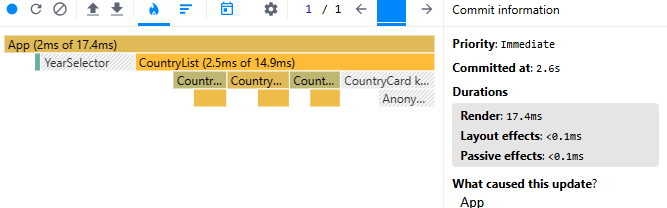  
**Ranked Chart:**  
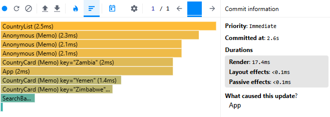

### Sort by population

- Commit duration: 2.2 s
- Render duration: 77.2 ms
- Observation: Sorting by population still requires additional calculations for each country, but memoization and virtualization significantly reduced rendering work. Commit duration decreased by 50.0% and render duration by 84.8%.

### Screenshot:

**Flame Graph:**  
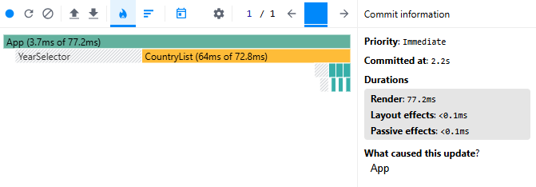  
**Ranked Chart:**  
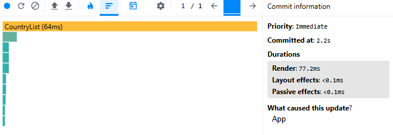

### Search country

- Commit duration: 4.7 s
- Render duration: 2.5 ms
- Observation: Search interactions became much more efficient. Memoized calculations and components prevent unnecessary re-renders, reducing commit duration by 78.6% and render duration by 93.8%.

### Screenshot:

**Flame Graph:**  
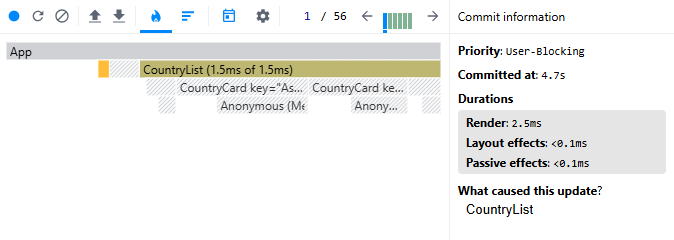  
**Ranked Chart:**  
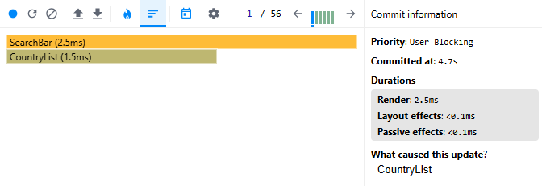

### Change year

- Commit duration: 2.9 s
- Render duration: 48 ms
- Observation: Changing the year still requires updating country data and tables, so rendering work remains necessary. Commit duration improved by 27.5%, while render duration increased by 37.5% because country cards and tables must update their displayed values for the newly selected year.

### Screenshot:

**Flame Graph:**  
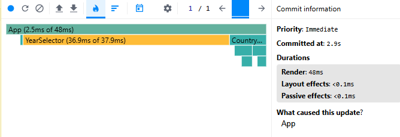  
**Ranked Chart:**  
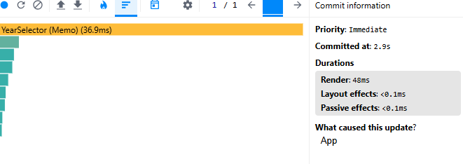

### Toggle columns

- Commit duration: 1 s
- Render duration: 16.2 ms
- Observation: Column toggling became more efficient after memoization and virtualization. Only affected components are updated, reducing commit duration by 44.4% and render duration by 68.3%.

### Screenshot:

**Flame Graph:**  
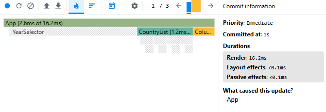  
**Ranked Chart:**  
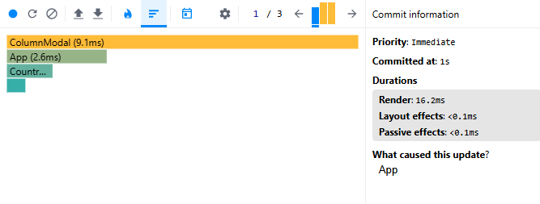

## Overall Results

The applied optimizations significantly improved application performance:

- useMemo reduced expensive recalculations of filtered and sorted country data.
- useCallback stabilized event handler references and prevented unnecessary child component updates.
- React.memo reduced avoidable re-renders of YearSelector, CountryCard, and DataTable.
- Proper keys improved React reconciliation.
- Custom virtualization reduced the number of rendered country cards from the full dataset to only the visible items.

The largest improvements were observed during sorting and searching operations, with render duration reductions ranging from 68% to 96% and commit duration reductions ranging from 27% to 79%.
